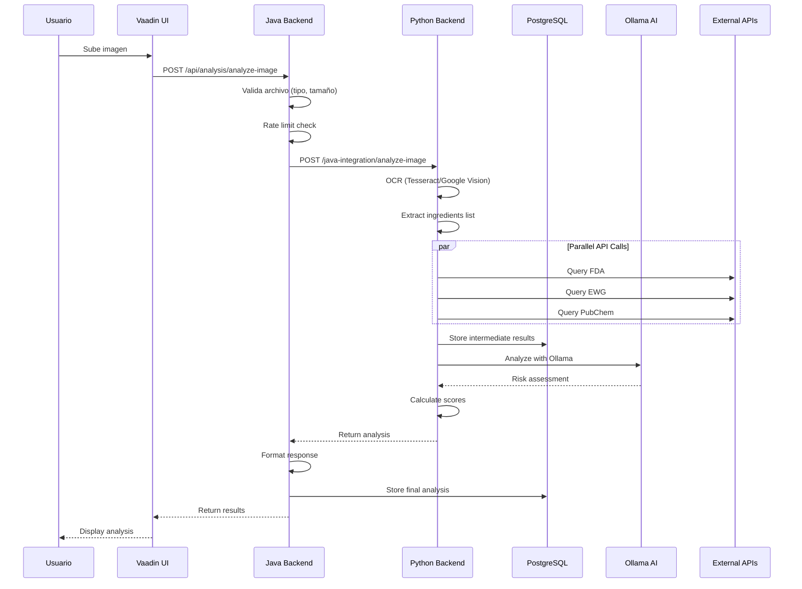
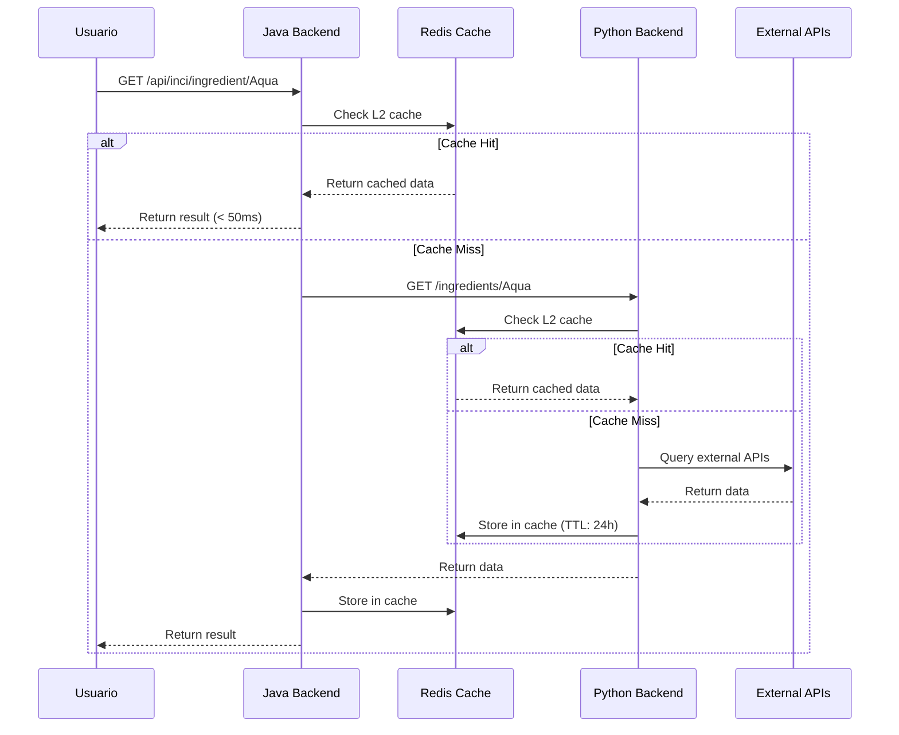
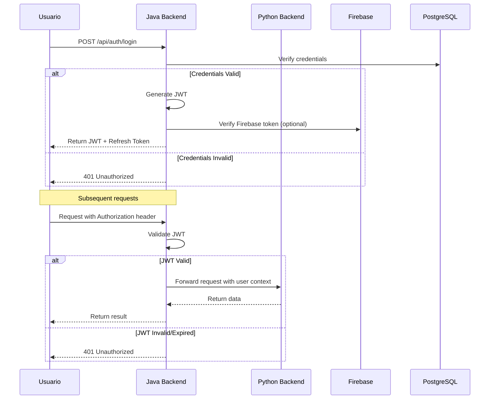

# MommyShops - Arquitectura del Sistema

## Tabla de Contenidos

1. [Visión General](#visión-general)
2. [Principios Arquitectónicos](#principios-arquitectónicos)
3. [Arquitectura de Microservicios](#arquitectura-de-microservicios)
4. [Componentes Principales](#componentes-principales)
5. [Flujos de Datos](#flujos-de-datos)
6. [Patrones de Diseño](#patrones-de-diseño)
7. [Seguridad](#seguridad)
8. [Escalabilidad](#escalabilidad)
9. [Resiliencia](#resiliencia)
10. [Monitoreo y Observabilidad](#monitoreo-y-observabilidad)

---

## Visión General

MommyShops utiliza una **arquitectura híbrida de microservicios** con dos backends especializados que se comunican entre sí:

### Stack Dual

```
┌─────────────────────────────────────────────────────────────┐
│                    CAPA DE PRESENTACIÓN                      │
│              Vaadin Flow (Java Frontend)                     │
└────────────────────────┬────────────────────────────────────┘
                         │
┌────────────────────────▼────────────────────────────────────┐
│              CAPA DE LÓGICA DE NEGOCIO                       │
│         Java Backend - Spring Boot (:8080)                   │
│  • API Gateway                                               │
│  • Autenticación/Autorización                                │
│  • Gestión de Usuarios                                       │
│  • Orquestación de Servicios                                 │
│  • Rate Limiting & Circuit Breakers                          │
└────────────────────────┬────────────────────────────────────┘
                         │ WebClient (HTTP/REST)
┌────────────────────────▼────────────────────────────────────┐
│              CAPA DE PROCESAMIENTO AI/ML                     │
│         Python Backend - FastAPI (:8000)                     │
│  • OCR & Vision                                              │
│  • Machine Learning                                          │
│  • AI Analysis (Ollama, Nemotron)                            │
│  • External API Integration                                  │
│  • Data Enrichment                                           │
└────────────────────────┬────────────────────────────────────┘
                         │
┌────────────────────────▼────────────────────────────────────┐
│                   CAPA DE DATOS                              │
│  ┌──────────────┐  ┌──────────────┐  ┌──────────────┐     │
│  │ PostgreSQL   │  │   Firebase   │  │    Redis     │     │
│  │ (Principal)  │  │  (Firestore) │  │   (Cache)    │     │
│  └──────────────┘  └──────────────┘  └──────────────┘     │
└─────────────────────────────────────────────────────────────┘
```

### Características Clave

- **Separación de Responsabilidades**: Java maneja negocio, Python maneja AI/ML
- **Comunicación Asíncrona**: WebClient reactivo con circuit breakers
- **Dual-Write**: Sincronización PostgreSQL + Firebase con eventual consistency
- **Cache Multi-Nivel**: L1 (Caffeine), L2 (Redis), L3 (Database)
- **Rate Limiting**: Por IP y por usuario
- **OCR Multi-Engine**: Tesseract + Google Vision
- **AI Híbrida**: Ollama (local) + NVIDIA Nemotron (cloud)

---

## Principios Arquitectónicos

### 1. Single Responsibility Principle (SRP)
Cada microservicio tiene una responsabilidad única:
- **Java**: Business logic, authentication, orchestration
- **Python**: AI/ML processing, OCR, external APIs

### 2. API-First Design
- Contratos de API definidos primero (OpenAPI/Swagger)
- Versionado de APIs (`/api/v1/`)
- DTOs explícitos para request/response

### 3. Fail-Safe & Resilience
- Circuit breakers en todas las llamadas externas
- Timeouts configurables
- Retry logic con exponential backoff
- Graceful degradation

### 4. Security by Design
- Zero-trust architecture
- JWT tokens con expiración
- CORS restrictivo
- Input validation en todos los endpoints
- Secret sanitization en logs

### 5. Observability
- Structured logging (JSON)
- Health checks en múltiples niveles
- Métricas de performance
- Distributed tracing (preparado)

---

## Arquitectura de Microservicios

### Servicio Java (Backend Principal)

**Puerto**: 8080  
**Framework**: Spring Boot 3.2+  
**Lenguaje**: Java 17

#### Responsabilidades

1. **API Gateway**
   - Punto de entrada único para frontend
   - Routing a servicios internos y Python backend
   - Rate limiting global

2. **Autenticación y Autorización**
   - JWT token generation/validation
   - Spring Security integration
   - User session management
   - Firebase authentication bridge

3. **Business Logic**
   - User profile management
   - Product analysis orchestration
   - Ingredient substitution recommendations
   - Data aggregation from multiple sources

4. **Persistencia**
   - PostgreSQL como source of truth
   - JPA/Hibernate ORM
   - Query optimization
   - Transaction management

5. **Cache Management**
   - Caffeine (in-memory, L1)
   - Redis (distributed, L2)
   - Cache invalidation strategies

#### Componentes Clave

```java
com.mommyshops/
├── controller/              # REST Controllers
│   ├── ProductAnalysisController
│   ├── HealthController
│   └── UserController
├── service/                 # Business Services
│   ├── ProductAnalysisService
│   ├── IngredientService
│   └── UserService
├── repository/              # Data Access
│   ├── UserProfileRepository
│   └── IngredientRepository
├── integration/             # External Services
│   └── client/
│       └── PythonBackendClient
├── config/                  # Configuration
│   ├── SecurityConfig
│   ├── WebClientConfig
│   └── RateLimitConfig
├── domain/                  # Entities & DTOs
│   ├── UserProfile
│   ├── Ingredient
│   └── ProductAnalysisResponse
└── security/                # Security
    ├── JwtTokenProvider
    └── JwtAuthenticationFilter
```

### Servicio Python (AI/ML Backend)

**Puerto**: 8000  
**Framework**: FastAPI 0.109+  
**Lenguaje**: Python 3.9+

#### Responsabilidades

1. **OCR Processing**
   - Tesseract OCR local
   - Google Vision API
   - Image preprocessing
   - Text extraction & cleaning

2. **AI/ML Analysis**
   - Ollama integration (Llama 3.1, LLaVA)
   - NVIDIA Nemotron multimodal
   - Ingredient risk assessment
   - Personalized recommendations

3. **External API Integration**
   - FDA API
   - EWG Database
   - PubChem
   - COSING (EU)
   - IARC
   - INVIMA
   - Skin Deep

4. **Data Enrichment**
   - Web scraping (ingredient info)
   - Data normalization
   - INCI name resolution
   - Hazard level calculation

5. **Firebase Sync**
   - Dual-write with PostgreSQL
   - Firebase Authentication
   - Firestore data sync
   - Eventual consistency handling

#### Componentes Clave

```python
backend/
├── api/
│   └── routes/              # API Endpoints
│       ├── auth.py
│       ├── analysis.py
│       ├── ollama.py
│       └── health.py
├── core/                    # Core Config
│   ├── config.py            # Settings
│   ├── security.py          # JWT, passwords
│   ├── database.py          # SQLAlchemy ORM
│   └── logging_config.py    # Structured logging
├── services/                # Business Logic
│   ├── ocr_service.py
│   ├── ingredient_service.py
│   ├── ml_service.py
│   ├── ollama_service.py
│   ├── external_api_service.py
│   └── sync_service.py      # Firebase/PG sync
├── models/                  # Pydantic Models
│   ├── requests.py
│   └── responses.py
├── middleware/              # Custom Middleware
│   └── rate_limit.py
└── main.py                  # FastAPI App
```

---

## Componentes Principales

### 1. API Gateway (Java)

**Patrón**: Gateway Pattern

```java
@RestController
@RequestMapping("/api")
public class ApiGatewayController {
    
    @Autowired
    private PythonBackendClient pythonClient;
    
    @Autowired
    private RateLimiter rateLimiter;
    
    // Route to Python for AI processing
    @PostMapping("/analyze")
    @CircuitBreaker(name = "pythonBackend", fallbackMethod = "analyzeImageFallback")
    @RateLimiter(name = "api")
    public Mono<ResponseEntity> analyzeProduct(
        @RequestParam MultipartFile file) {
        
        return pythonClient.analyzeImage(file)
            .map(this::processResponse);
    }
}
```

### 2. Python Backend Client (Java)

**Patrón**: Client Pattern, Circuit Breaker

```java
@Component
public class PythonBackendClient {
    
    private final WebClient webClient;
    private final CircuitBreaker circuitBreaker;
    
    public Mono<ProductAnalysisResponse> analyzeImage(
        MultipartFile file, String userNeed) {
        
        return circuitBreaker.run(
            webClient.post()
                .uri("/java-integration/analyze-image")
                .body(buildMultipartBody(file, userNeed))
                .retrieve()
                .bodyToMono(ProductAnalysisResponse.class)
                .timeout(Duration.ofSeconds(30)),
            throwable -> handleFallback(throwable)
        );
    }
}
```

### 3. OCR Service (Python)

**Patrón**: Strategy Pattern (múltiples engines)

```python
class OCRService:
    """Multi-engine OCR service"""
    
    def __init__(self):
        self.tesseract_engine = TesseractEngine()
        self.google_vision_engine = GoogleVisionEngine()
    
    async def extract_text(self, image: bytes) -> OCRResult:
        """
        Extract text using best available engine
        Falls back to Tesseract if Google Vision fails
        """
        try:
            # Try Google Vision first (better accuracy)
            if google_vision_available():
                return await self.google_vision_engine.extract(image)
        except Exception as e:
            logger.warning(f"Google Vision failed: {e}")
        
        # Fallback to Tesseract
        return await self.tesseract_engine.extract(image)
```

### 4. Sync Service (Python)

**Patrón**: Dual-Write, Eventual Consistency

```python
class SyncService:
    """
    Synchronize data between PostgreSQL and Firebase
    PostgreSQL is source of truth
    """
    
    async def sync_user_create(
        self, user_data: dict, db: Session, firebase_client
    ) -> dict:
        """
        1. Write to PostgreSQL (ACID guarantees)
        2. Async write to Firebase (eventual consistency)
        3. Retry on failure with exponential backoff
        """
        # Step 1: PostgreSQL (synchronous)
        db_user = User(**user_data)
        db.add(db_user)
        db.commit()
        
        # Step 2: Firebase (asynchronous with retry)
        try:
            await self._sync_to_firebase(db_user, firebase_client)
        except Exception as e:
            # Queue for retry
            await self.queue_sync_retry({
                "operation": "create_user",
                "user_id": db_user.id,
                "data": user_data
            })
        
        return {"success": True, "user_id": db_user.id}
```

### 5. Rate Limiting Middleware (Python)

**Patrón**: Sliding Window Algorithm

```python
class RateLimitMiddleware(BaseHTTPMiddleware):
    """
    Rate limiting with sliding window
    - 100 requests per minute (window)
    - 10 requests per second (burst)
    """
    
    async def dispatch(self, request: Request, call_next):
        client_ip = request.client.host
        
        # Check rate limits
        if await self.is_rate_limited(client_ip):
            return JSONResponse(
                status_code=429,
                content={"error": "Rate limit exceeded"},
                headers={"Retry-After": "60"}
            )
        
        # Track request
        await self.track_request(client_ip)
        
        response = await call_next(request)
        
        # Add rate limit headers
        response.headers["X-RateLimit-Limit"] = "100"
        response.headers["X-RateLimit-Remaining"] = str(remaining)
        
        return response
```

---

## Flujos de Datos

### Flujo 1: Análisis de Imagen de Producto



**Tiempo Estimado**: 5-10 segundos
**Puntos de Fallo**: OCR, External APIs, AI model
**Estrategia**: Circuit breakers, timeouts, fallbacks

### Flujo 2: Consulta de Ingrediente



**Tiempo Estimado**: 
- Cache hit: < 50ms
- Cache miss: 1-3 segundos

### Flujo 3: Autenticación JWT



---

## Patrones de Diseño

### 1. Circuit Breaker Pattern

**Problema**: Fallos en cascada cuando servicios externos fallan

**Solución**: Circuit breaker que abre después de X fallos consecutivos

```java
@CircuitBreaker(
    name = "pythonBackend",
    fallbackMethod = "fallback"
)
public Mono<Response> callPythonBackend() {
    // Call Python backend
}

public Mono<Response> fallback(Exception e) {
    // Return cached data or default response
    return Mono.just(defaultResponse());
}
```

**Estados**:
- **CLOSED**: Requests pasan normalmente
- **OPEN**: Requests fallan inmediatamente
- **HALF_OPEN**: Intenta recuperación

### 2. Repository Pattern

**Problema**: Acoplamiento con capa de datos

**Solución**: Abstracción de acceso a datos

```java
@Repository
public interface UserProfileRepository extends JpaRepository<UserProfile, Long> {
    Optional<UserProfile> findByEmail(String email);
    List<UserProfile> findBySkinType(SkinType skinType);
}
```

### 3. Strategy Pattern (OCR Engines)

**Problema**: Múltiples algoritmos OCR con diferentes trade-offs

**Solución**: Interfaz común con implementaciones intercambiables

```python
class OCREngine(ABC):
    @abstractmethod
    async def extract_text(self, image: bytes) -> str:
        pass

class TesseractEngine(OCREngine):
    async def extract_text(self, image: bytes) -> str:
        # Tesseract implementation
        pass

class GoogleVisionEngine(OCREngine):
    async def extract_text(self, image: bytes) -> str:
        # Google Vision implementation
        pass
```

### 4. Factory Pattern (Response Building)

```java
public class ResponseFactory {
    public static AnalysisResponse buildSuccessResponse(
        ProductAnalysis analysis) {
        return AnalysisResponse.builder()
            .status("success")
            .data(analysis)
            .timestamp(Instant.now())
            .build();
    }
    
    public static AnalysisResponse buildErrorResponse(
        String error) {
        return AnalysisResponse.builder()
            .status("error")
            .error(error)
            .timestamp(Instant.now())
            .build();
    }
}
```

### 5. Observer Pattern (Logging & Monitoring)

```python
class AnalysisEvent:
    """Event emitted during analysis"""
    pass

class AnalysisObserver(ABC):
    @abstractmethod
    def update(self, event: AnalysisEvent):
        pass

class LoggingObserver(AnalysisObserver):
    def update(self, event: AnalysisEvent):
        logger.info(f"Analysis event: {event}")

class MetricsObserver(AnalysisObserver):
    def update(self, event: AnalysisEvent):
        metrics.record(event)
```

---

## Seguridad

### Modelo de Amenazas

1. **Injection Attacks** (SQL, NoSQL)
   - **Mitigación**: Prepared statements, ORM, input validation

2. **Broken Authentication**
   - **Mitigación**: JWT con expiración corta, refresh tokens, MFA

3. **Sensitive Data Exposure**
   - **Mitigación**: HTTPS, encryption at rest, secret sanitization en logs

4. **XML External Entities (XXE)**
   - **Mitigación**: Deshabilitar external entities, validar XML

5. **Broken Access Control**
   - **Mitigación**: Role-based access control (RBAC), ownership checks

6. **Security Misconfiguration**
   - **Mitigación**: Secure defaults, environment-specific config

7. **Cross-Site Scripting (XSS)**
   - **Mitigación**: Output encoding, CSP headers, input validation

8. **Insecure Deserialization**
   - **Mitigación**: No deserializar datos no confiables

9. **Using Components with Known Vulnerabilities**
   - **Mitigación**: Dependabot, automated security scans

10. **Insufficient Logging & Monitoring**
    - **Mitigación**: Structured logging, SIEM integration

### Capas de Seguridad

```
┌───────────────────────────────────────────────────────┐
│ Layer 1: Network Security                             │
│ - HTTPS/TLS 1.3                                       │
│ - Firewall rules                                      │
│ - DDoS protection                                     │
└───────────────────────┬───────────────────────────────┘
                        │
┌───────────────────────▼───────────────────────────────┐
│ Layer 2: API Gateway Security                         │
│ - CORS restrictivo                                    │
│ - Rate limiting                                       │
│ - Trusted hosts                                       │
└───────────────────────┬───────────────────────────────┘
                        │
┌───────────────────────▼───────────────────────────────┐
│ Layer 3: Authentication & Authorization               │
│ - JWT tokens                                          │
│ - Spring Security                                     │
│ - Firebase Auth                                       │
└───────────────────────┬───────────────────────────────┘
                        │
┌───────────────────────▼───────────────────────────────┐
│ Layer 4: Application Security                         │
│ - Input validation                                    │
│ - Output encoding                                     │
│ - File upload validation                              │
│ - SQL injection prevention                            │
└───────────────────────┬───────────────────────────────┘
                        │
┌───────────────────────▼───────────────────────────────┐
│ Layer 5: Data Security                                │
│ - Encryption at rest                                  │
│ - Encryption in transit                               │
│ - Secret management                                   │
│ - Backup encryption                                   │
└───────────────────────────────────────────────────────┘
```

---

## Escalabilidad

### Escalado Horizontal

#### Python Backend
```bash
# Docker Compose - múltiples instancias
services:
  python-backend:
    image: mommyshops-python:latest
    deploy:
      replicas: 3
    ports:
      - "8000-8002:8000"
```

#### Java Backend
```bash
# Kubernetes deployment
apiVersion: apps/v1
kind: Deployment
metadata:
  name: java-backend
spec:
  replicas: 3
  selector:
    matchLabels:
      app: java-backend
  template:
    spec:
      containers:
      - name: java-backend
        image: mommyshops-java:latest
        resources:
          requests:
            memory: "1Gi"
            cpu: "500m"
          limits:
            memory: "2Gi"
            cpu: "1000m"
```

### Load Balancing

```nginx
upstream java_backend {
    least_conn;
    server java-1:8080 weight=1;
    server java-2:8080 weight=1;
    server java-3:8080 weight=1;
}

upstream python_backend {
    least_conn;
    server python-1:8000 weight=1;
    server python-2:8000 weight=1;
    server python-3:8000 weight=1;
}
```

### Cache Strategy

**Multi-Level Caching**:

1. **L1 (Caffeine)**: In-memory, 100ms latency, 1GB size
2. **L2 (Redis)**: Distributed, 5ms latency, 10GB size
3. **L3 (Database)**: Persistent, 50ms latency, unlimited

```java
public Ingredient getIngredient(String name) {
    // L1 Cache
    Ingredient result = caffeineCache.get(name);
    if (result != null) return result;
    
    // L2 Cache
    result = redisCache.get(name);
    if (result != null) {
        caffeineCache.put(name, result);
        return result;
    }
    
    // L3 Database
    result = database.findByName(name);
    redisCache.put(name, result, Duration.ofHours(24));
    caffeineCache.put(name, result);
    
    return result;
}
```

### Database Optimization

**Indexación**:
```sql
CREATE INDEX idx_ingredient_name ON ingredients(name);
CREATE INDEX idx_ingredient_inci_name ON ingredients(inci_name);
CREATE INDEX idx_user_email ON users(email);
CREATE INDEX idx_analysis_user_id ON product_analysis(user_id);
```

**Query Optimization**:
- Usar `EXPLAIN ANALYZE` para queries lentas
- Batch inserts para múltiples ingredientes
- Pagination para listas grandes
- Read replicas para consultas

---

## Resiliencia

### Circuit Breaker Configuration

```yaml
resilience4j:
  circuitbreaker:
    instances:
      pythonBackend:
        slidingWindowSize: 10
        failureRateThreshold: 50
        waitDurationInOpenState: 10000
        permittedNumberOfCallsInHalfOpenState: 3
```

### Retry Logic

```java
@Retry(
    name = "externalApi",
    fallbackMethod = "fallback"
)
public Mono<Response> callExternalApi() {
    return webClient.get()
        .uri("/api/data")
        .retrieve()
        .bodyToMono(Response.class);
}
```

### Timeouts

```python
# Python - Timeouts configurables
async with httpx.AsyncClient(timeout=30.0) as client:
    response = await client.get(url)
```

```java
// Java - Timeouts en WebClient
webClient.get()
    .uri(url)
    .retrieve()
    .bodyToMono(String.class)
    .timeout(Duration.ofSeconds(30))
```

### Graceful Degradation

```python
async def analyze_product(image):
    try:
        # Try AI analysis
        return await ollama_service.analyze(image)
    except OllamaUnavailableError:
        # Fallback to rule-based analysis
        logger.warning("Ollama unavailable, using fallback")
        return await rule_based_analyzer.analyze(image)
    except Exception as e:
        # Last resort: basic analysis
        logger.error(f"All analyzers failed: {e}")
        return basic_analysis(image)
```

---

## Monitoreo y Observabilidad

### Health Checks

```java
@RestController
public class HealthController {
    
    @GetMapping("/health")
    public Health health() {
        return Health.builder()
            .withDetail("database", checkDatabase())
            .withDetail("redis", checkRedis())
            .withDetail("pythonBackend", checkPythonBackend())
            .build();
    }
}
```

### Structured Logging

```python
logger.info(
    "Product analysis completed",
    extra={
        "user_id": user_id,
        "product_id": product_id,
        "processing_time_ms": elapsed_ms,
        "ingredients_count": len(ingredients),
        "risk_level": risk_level
    }
)
```

### Metrics (Prometheus Ready)

```java
@Timed(value = "analysis.time", description = "Time to analyze product")
public Mono<Analysis> analyzeProduct(Product product) {
    counter.increment("analysis.count");
    // Analysis logic
}
```

### Alerting

```yaml
alerts:
  - name: HighErrorRate
    condition: error_rate > 0.05
    duration: 5m
    action: send_slack_notification
    
  - name: SlowResponseTime
    condition: p95_latency > 5000ms
    duration: 5m
    action: send_pagerduty_alert
```

---

## Decisiones de Arquitectura (ADR)

### ADR-001: Dual Backend Architecture

**Contexto**: Necesidad de procesamiento AI/ML intensivo + lógica de negocio compleja

**Decisión**: Arquitectura dual con Java (negocio) + Python (AI/ML)

**Consecuencias**:
- ✅ Especialización de tecnologías
- ✅ Escalado independiente
- ❌ Complejidad de comunicación
- ❌ Latencia adicional

### ADR-002: PostgreSQL como Source of Truth

**Contexto**: Dual-write a PostgreSQL y Firebase

**Decisión**: PostgreSQL es source of truth, Firebase eventual consistency

**Consecuencias**:
- ✅ ACID guarantees
- ✅ Mejor para queries complejas
- ❌ Firebase puede estar desactualizado
- ❌ Complejidad de sincronización

### ADR-003: Rate Limiting en Múltiples Niveles

**Contexto**: Protección contra abuso y sobrecarga

**Decisión**: Rate limiting en middleware + per-endpoint

**Consecuencias**:
- ✅ Protección granular
- ✅ Mejor UX (headers informativos)
- ❌ Complejidad de configuración

---

**Última actualización**: 2025-10-24  
**Versión**: 3.0.0  
**Autor**: MommyShops Team
